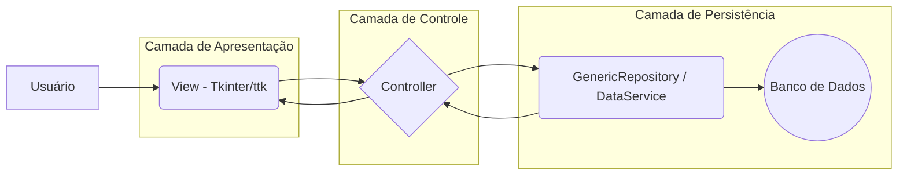

```markdown
# ✨ NexlifyTTk ✨ - Forjando Aplicações Desktop Robustas com Elegância

**Bem-vindo ao NexlifyTTk**, um template Python meticulosamente projetado para capacitar desenvolvedores na criação de aplicações desktop sofisticadas, seguras e orientadas a dados. Utilizando o poder nativo do **Tkinter/ttk**, o NexlifyTTk oferece uma abordagem moderna e produtiva para desenvolvimento.

Cansado da complexidade desnecessária ou da falta de estrutura em projetos Tkinter? O NexlifyTTk é a solução definitiva, oferecendo uma **base MVC coesa**, **segurança integrada de ponta**, **suporte multi-banco flexível** e um **arsenal de ferramentas** que tornam o desenvolvimento fluido e eficiente.

---

## 🌟 Pilares Fundamentais do Framework

O NexlifyTTk foi construído sobre cinco pilares que garantem excelência e longevidade aos seus projetos.

### 🏛️ 1. Arquitetura MVC Iluminada
- **Clareza Estrutural**: Separação rigorosa entre Interface (`View`), Lógica de Negócios (`Controller`) e Acesso a Dados (`Model`).
- **Manutenibilidade**: Modificações e expansões são intuitivas, com baixo acoplamento entre componentes.
- **Testabilidade**: Camadas isoladas facilitam a criação de testes unitários precisos.
- **Escalabilidade**: Estrutura modular suporta o crescimento orgânico da aplicação sem comprometer a organização.

### 🛡️ 2. Segurança Inabalável
- **Autenticação Robusta**: Senhas protegidas com **hashing bcrypt**, o padrão contra ataques de força bruta e rainbow tables.
- **Credenciais Sigilosas**: Chaves de acesso ao banco (`banco.ini`) são criptografadas com **Fernet (AES)**, vinculadas a uma `secret.key` local, eliminando exposição de dados sensíveis.

### 🗄️ 3. Flexibilidade Multi-Banco
- **SQLAlchemy Core**: Comunicação agnóstica e eficiente com diversos SGBDs.
- **Configuração Simplificada**: Alterne entre bancos com uma edição no arquivo `banco.ini`.
- **Suporte Abrangente**:
  - SQLite (`sqlite3`)
  - PostgreSQL (`psycopg2-binary`)
  - MySQL (`PyMySQL`)
  - MariaDB (`mariadb`)
  - Microsoft SQL Server (`pymssql`)
  - Oracle (`oracledb`) *— Requer driver específico*
  - Firebird (`fdb`) *— Requer driver específico*
- **Consistência**: Normalização de nomes de colunas para minúsculas, garantindo compatibilidade cross-SGBD.

### 🎨 4. Interface Nativa & Adaptável
- **Visual Profissional**: Tema `clam` do `ttk` oferece aparência limpa e moderna em diferentes sistemas operacionais.
- **Personalização**: Preferências de tema (cores, fontes, tamanhos, bordas) salvas em `settings.json` e carregadas automaticamente.

### 💾 5. Camada de Persistência Inteligente
- **`GenericRepository`**: Centraliza operações CRUD, desacoplando Controllers dos detalhes do SQL.
- **`DataService`**: Orquestra transações complexas com múltiplas tabelas, garantindo **atomicidade**.

---

## 🚀 Destaques do Desenvolvimento Integrado

O NexlifyTTk inclui ferramentas que aceleram o desenvolvimento e garantem qualidade:

- **Validação de Configuração**: O `run.py` verifica consistência das flags em `config.py` (ex.: `USE_LOGIN=True` requer `DATABASE_ENABLED=True`).
- **Gerenciamento Visual**: Configurações de banco (`banco.ini`) e flags (`config.py`) gerenciáveis por interfaces gráficas.
- **Segurança Criptográfica**: Credenciais do `banco.ini` são criptografadas/descriptografadas automaticamente.
- **Temas Persistentes**: Estado do tema (fontes, cores) salvo em `settings.json`.
- **Logging Avançado**: Suporte a handlers rotativos, com redirecionamento de `print` e `sys.stderr` para arquivos de log.

---

## 🗺️ Arquitetura e Fluxo de Dados

O framework adota uma abordagem em camadas clara, promovendo organização e baixo acoplamento.



### Exemplo de Fluxo: Salvando um Novo Usuário
1. A **View** aciona o método `salvar_usuario` no **Controller**.
2. O **Controller** valida os dados e usa `persistencia.auth.hash_password` para gerar o hash da senha.
3. O **Controller** monta um DataFrame Pandas e chama `GenericRepository.insert_dataframe_to_table("usuarios", df)` (Model).
4. O **GenericRepository** executa o INSERT no banco via SQLAlchemy.
5. Em caso de sucesso, o **Controller** recarrega os dados e atualiza a **View**.

---

## 🗂️ Estrutura de Arquivos

```
/├── run.py                     # Ponto de entrada, valida config e inicializa DB
├── app.py                     # Classe principal da aplicação Tkinter
├── config.py                  # Configurações globais (flags, logs, etc.)
├── banco.ini                  # Configurações de conexão com bancos
├── settings.json              # Configurações de tema/UI salvas
├── secret.key                 # Chave de criptografia (NÃO COMPARTILHAR!)
│
├── panels/                    # Módulos dos painéis principais
│   ├── __init__.py            # Registra painéis disponíveis
│   ├── base_panel.py          # Classe base abstrata para painéis
│   ├── *_controller.py        # Lógica de controle dos painéis
│   ├── *_view.py              # Interface (widgets) dos painéis
│
├── modals/                    # Janelas modais com lógica própria
│   ├── *_controller.py
│   ├── *_view.py
│   ├── *_model.py             # Lógica de dados específica (se necessário)
│
├── dialogs/                   # Diálogos simples (Toplevels)
│   ├── login_ui.py            # Diálogo de login
│   ├── about_dialog.py        # Diálogo "Sobre"
│   ├── advanced_theme_dialog.py # Personalização de tema
│
└── persistencia/              # Camada de acesso a dados
    ├── database.py            # Gerencia conexão com o banco
    ├── repository.py          # CRUD genérico com SQLAlchemy e Pandas
    ├── data_service.py        # Orquestra transações atômicas
    ├── auth.py                # Hashing e verificação de senhas (bcrypt)
    ├── security.py            # Criptografia/descriptografia (Fernet)
    ├── logger.py              # Sistema de logging
    ├── sql_schema_*.sql       # Scripts SQL para criação de tabelas
```

---

## ⚙️ Configuração e Execução

### Pré-requisitos
- **Python**: 3.9 ou superior
- **Pip**: Instalador de pacotes Python
- **Git**: Para clonar o repositório

### 1️⃣ Clonagem
```bash
git clone <URL_DO_REPOSITORIO>
cd <NOME_DO_REPOSITORIO>
```

### 2️⃣ Ambiente Virtual
```bash
# Windows
python -m venv .venv
.venv\Scripts\activate

# macOS/Linux
python3 -m venv .venv
source .venv/bin/activate
```

### 3️⃣ Instalação de Dependências
Instale as bibliotecas listadas em `requirements.txt`:

| Pacote             | Versão  |
|--------------------|---------|
| bcrypt             | 5.0.0   |
| cffi               | 2.0.0   |
| cryptography       | 46.0.2  |
| GPUtil             | 1.4.0   |
| greenlet           | 3.2.4   |
| mariadb            | 1.1.14  |
| numpy              | 2.3.3   |
| packaging          | 25.0    |
| pandas             | 2.3.3   |
| pillow             | 10.4.0  |
| psutil             | 7.1.0   |
| pycparser          | 2.23    |
| PyMySQL            | 1.1.2   |
| python-dateutil    | 2.9.0.post0 |
| pytz               | 2025.2  |
| six                | 1.17.0  |
| SQLAlchemy         | 2.0.43  |
| ttkbootstrap       | 1.14.4  |
| typing_extensions  | 4.15.0  |
| tzdata             | 2025.2  |

```bash
pip install -r requirements.txt
```

### 4️⃣ Configuração do Banco
1. Abra `banco.ini`.
2. Descomente apenas a seção do banco desejado (ex.: `[postgresql]`).
3. Comente as demais seções (apenas UMA ativa).
4. Ajuste `host`, `port`, `dbname`, `user` e `password`.
5. **Nota**: Se `user`/`password` começarem com `gAAAAA...`, estão criptografados. Gere novos valores criptografados, se necessário.

### 5️⃣ Execução
```bash
python run.py
```

A aplicação iniciará, exibindo a tela de login se `USE_LOGIN=True` em `config.py`.

---

## ✨ Criando um Novo Painel

### Passos
1. **Duplique os Arquétipos**: Copie `panels/painel_modelo_controller.py` e `panels/painel_modelo_view.py`.
2. **Renomeie**: Ex.: `PainelGerenciarProdutosController`, `GerenciarProdutosView`.
3. **Defina o Controller**:
   - Ajuste `PANEL_NAME` (ex.: "Gerenciar Produtos").
   - Defina `PANEL_ICON` (ex.: "📦").
   - Configure `ALLOWED_ACCESS` (perfis permitidos).
4. **Molde a View**: Adicione widgets em `_create_widgets` (ex.: `ttk.Label`, `ttk.Entry`, `ttk.Treeview`).
5. **Implemente a Lógica**: Crie métodos no Controller para eventos, persistência e atualização da View.
6. **Registre**: Adicione o novo Controller em `panels/__init__.py` na lista `ALL_PANELS`.

---

## 📜 Licença

Este projeto está licenciado sob a **Licença MIT**. Veja o arquivo `LICENSE` para detalhes.

---

*Última atualização: 18 de outubro de 2025*
```
